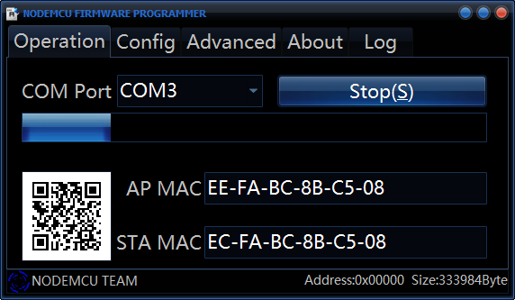
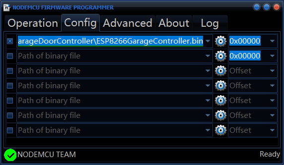
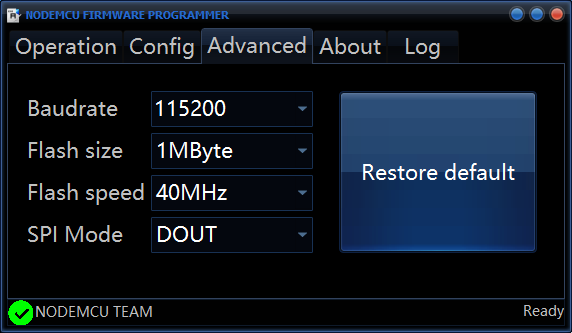

# GarageESP
This project utilizes ESP8266 based NodeMcu and relay board to control a garage door with SmartThings.

## Hardware

This project utilizes a NodeMcu V3 and a 2 relay module.  Both items can be sourced on Aliexpress.  

Costs

 

NodeMcu V3 - $2.33  

2 Relay Module - $1.09  

Magnetic Contact Sensor - $1.00

Female to Female Jumper Wires - $0.50  

## Installation
### Flash
Flash the ESP8266GarageController.bin found in the root of this project to the NodeMcu using NodeMcu-flasher.
https://github.com/nodemcu/nodemcu-flasher

Or use Arduino IDE to compile the source and flash to the NodeMcu.  The source code can be found under /source/ESP8266GarageControllerSource.

Hold the flash button on the NodeMCU and press the rst button to put the NodeMCU into flash mode.

After flashing the NodeMCU will create a hotspot named GarageDoor.XXXX.  The hotspot will be password protected with the default password of "p0wnMyGarage".  This password can be changed in the source code and recompiled.  If the hotspot does not come up, hold the flash button for 20 seconds then restart the NodeMCU.

Once connected to the hotspot, a captive portal should pop up allowing you to configure the connection to your WiFi.  Click the Confirgure WiFi button.  It will take a few seconds for the next screen to load because the NodeMCU is scanning for avilabile WiFi networks.  Once loaded select the WiFi network, put in your password and click save.  You will be disconnected from the NodeMCU and it will connect to your WiFi.

### SmartThings Device Handler

Install the GarageESP device handler in your SmartThings account.
/source/GarageESP-Device Handler.groovy

### SmartThings SmartApp

Install the GarageESP smart app in your SmartThings account.
/source/SmartThingsGarageESP-SmartApp.groovy

## Alexa
If you have your SmartThings paird with Alexa then you should be able to control and check the state of your garage door.  You can say: 
"Alexa unlock garage door" - Alexa will force your to setup a secure passcode to unlock. 
"Alexa lock garage door" 
"Alexa is my garage door closed?" 
Alexa does not understand the phrases open garage door or close garage door currently. 

## Apple HomeKit
If you have HomeBridge connected to SmartThings then your can use the following voice commands with Siri: 
"Hey Siri open garage door" - Siri will ask you to unlock your phone before opening. 
"Hey Siri close garage door" 
"Hey Siri is the garage door closed?" 
