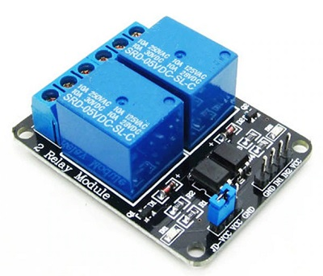

# GarageESP
This project utilizes ESP8266 based NodeMcu and relay board to control a garage door with SmartThings.

## Hardware

This project utilizes a NodeMcu V3 and a 2 relay modeule.  Both items can be sourced on Aliexpress.  

Costs
NodeMcu V3 - $2.33  
2 Relay Module - $1.09  
Female to Female Jumper Wires - $0.50  

  

  

## Flash

https://github.com/nodemcu/nodemcu-flasher

## SmartThings Device Handler

## SmartThings SmartAppp

